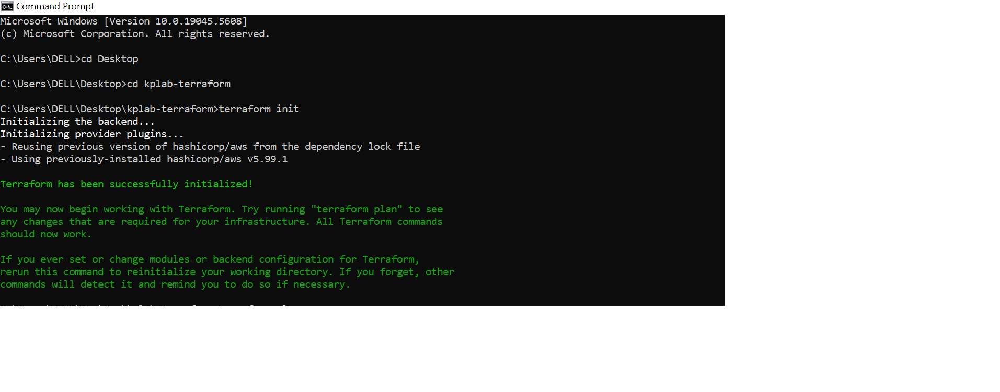
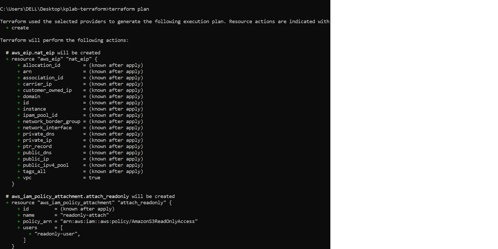
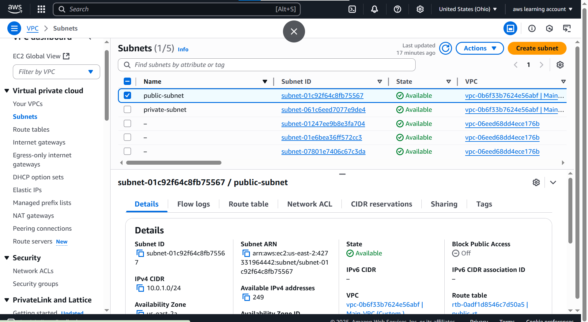
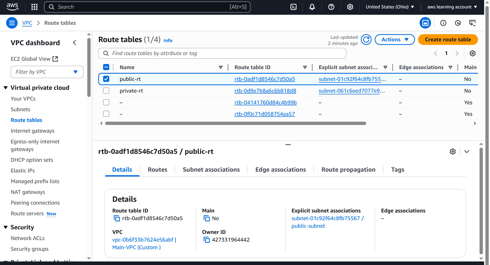
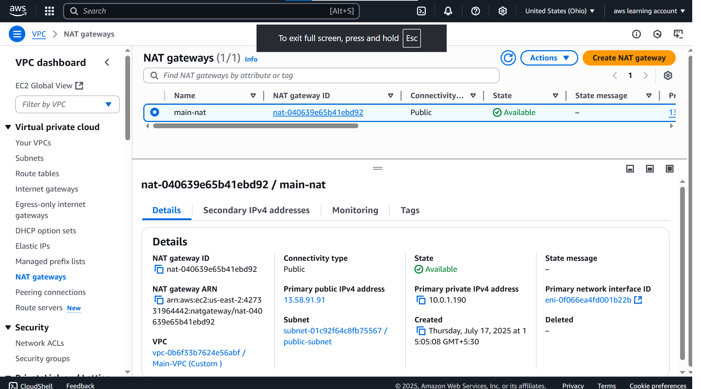
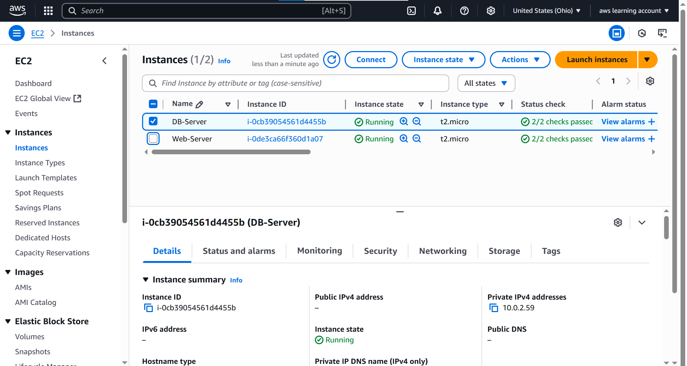
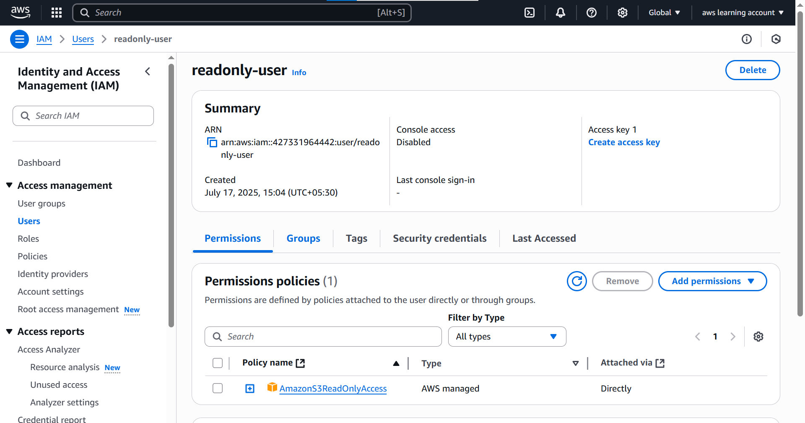
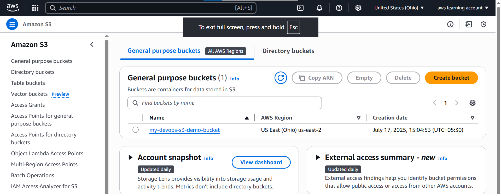

#  AWS Custom VPC/EC2/S3 Bucket Infrastructure with Terraform

This project creates a production-style AWS setup using Terraform Infrastructure as Code (IaC). It includes:

- Custom VPC with public and private subnets
- EC2 Web Server in public subnet
- Database Server in private subnet (no internet access)
- NAT Gateway for private subnet internet access
- Auto Scaling Group with Application Load Balancer (ALB)
- IAM User with custom policy for S3 read-only access
- S3 bucket creation
- Route Tables, Internet Gateway, Security Groups

---

##  Tools & Technologies

- **AWS**
- **Terraform v1.6+**
- **VS Code**
- **Git & GitHub**

---

##  Folder Structure
project-root/
├── Screenshot/ # All screenshot outputs of Terraform and AWS resources
├── main.tf
├── iam.tf
├── output.tf
├── provider.tf
├── variables.tf
├── s3.tf
└── README.md

---

##  Screenshots of Terraform Outputs & AWS Resources

### Terraform Init

### Terraform Plan

### Custom VPC Output

### Public & Private Subnets Output

### Route Table Output

### NAT Gateway Output

### EC2 Web Server & DB Server Output

### IAM User Dashboard Output

### S3 Bucket Output

---

##   Terraform Configuration Files Overview

| ### Terraform Configuration Files Overview
### 🧾 Terraform Configuration Files Overview

| File Name      | Description                          | View Code                                 |
|----------------|--------------------------------------|-------------------------------------------|
| `main.tf`      | VPC, Subnets, IGW, NAT, Route Tables | [View Code](./.TF%20Files/main.tf)        |
| `iam.tf`       | IAM Roles and Policies               | [View Code](./.TF%20Files/iam.tf)         |
| `output.tf`    | Output definitions                   | [View Code](./.TF%20Files/output.tf)      |
| `variables.tf` | Input variables                      | [View Code](./.TF%20Files/variables.tf)   |
| `s3.tf`        | S3 Bucket creation                   | [View Code](./.TF%20Files/s3.tf)          |
| `provider.tf`  | AWS Provider configuration           | [View Code](./.TF%20Files/provider.tf)    |
| `ec2.tf`       | ec2 configuration                    | [View Code](./.TF%20Files/EC2.TF)         |

